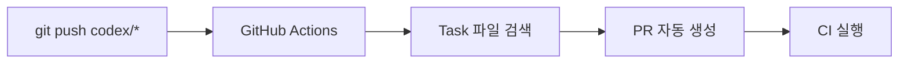
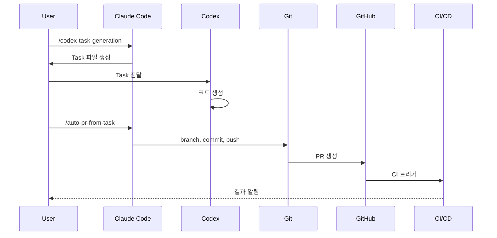

# Codex 자동화 워크플로우 요약

## 🎯 목표
**Codex 코드 생성 → PR 생성 → CI 실행까지 완전 자동화**

---

## 📋 3가지 방법 비교

| 방법 | 실행 | 자동화 수준 | 설정 난이도 | 추천 시나리오 |
|------|------|------------|------------|--------------|
| **1. Claude Skill** ⭐ | `/auto-pr-from-task` | ⭐⭐⭐ 중간 | 🟢 쉬움 | 개인, 수동 제어 |
| **2. GitHub Actions** | `git push codex/*` | ⭐⭐⭐⭐⭐ 완전 | 🟡 보통 | 팀 협업, 규칙 |
| **3. Shell Script** | `./scripts/auto-pr.sh` | ⭐⭐ 낮음 | 🟢 쉬움 | 빠른 실행 |

---

## ✅ 방법 1: Claude Code Skill (추천)

### 사용법
```bash
# Step 1: Task 생성
/codex-task-generation
# → docs/tasks/codex-20260107-phase4-dashboard.md

# Step 2: Codex가 코드 생성
# (apps/doctor-dashboard/, server/api/, ...)

# Step 3: 자동 PR 생성
/auto-pr-from-task
```

### 자동으로 수행
1. ✅ Feature branch 생성 (`feature/phase4-dashboard`)
2. ✅ 변경사항 commit
3. ✅ Remote push
4. ✅ GitHub PR 생성
5. ✅ CI 자동 실행

### 사전 준비
```bash
# gh CLI 설치
brew install gh  # macOS
# 또는
winget install GitHub.cli  # Windows

# 인증
gh auth login
```

### 결과
```
✅ Branch: feature/phase4-dashboard
✅ Commit: feat(dashboard): Phase 4 의사 대시보드 구현
✅ PR: https://github.com/owner/befora-poc/pull/123
🔄 CI running...
```

---

## 🤖 방법 2: GitHub Actions (완전 자동화)

### 사용법
```bash
# Codex가 코드 생성 후
git checkout -b codex/phase4-dashboard
git add .
git commit -m "feat(dashboard): Phase 4 구현"
git push origin codex/phase4-dashboard

# GitHub Actions가 자동으로 PR 생성!
```

### Workflow


### 설정 파일
- `.github/workflows/auto-pr-from-codex.yml` ✅ 생성됨

### 장점
- 완전 자동화 (클릭 없음)
- 팀 전체 적용 쉬움
- 브랜치 규칙으로 통제

---

## 🚀 방법 3: Shell Script (빠른 실행)

### 사용법
```bash
# 가장 최근 task 파일 사용
./scripts/auto-pr.sh

# 특정 task 파일 지정
./scripts/auto-pr.sh docs/tasks/codex-20260107-phase4-dashboard.md
```

### 내부 동작
```bash
1. Task 파일 파싱
2. Branch 생성 (feature/{name})
3. Commit
4. Push
5. gh pr create
```

---

## 📊 워크플로우 선택 가이드

### 개인 개발자
```
방법 1 (Claude Skill) 추천

이유:
- IDE에서 바로 실행
- 유연한 제어
- 디버깅 쉬움
```

### 팀 협업
```
방법 2 (GitHub Actions) 추천

이유:
- 일관된 PR 생성
- 권한 관리 쉬움
- 브랜치 규칙 강제
```

### 빠른 프로토타이핑
```
방법 3 (Shell Script) 추천

이유:
- 한 줄로 실행
- 추가 설정 없음
- 로컬 제어
```

---

## 🔄 통합 워크플로우

### 전체 프로세스


### 실제 실행 예시
```bash
# 1. Task 생성 (5초)
/codex-task-generation
# 입력: "Phase 4 의사 대시보드 구현"
# → docs/tasks/codex-20260107-phase4-dashboard.md

# 2. Codex 코드 생성 (3분)
# Codex에게 전달: "이 task 파일 보고 코드 생성해줘"
# → apps/doctor-dashboard/ 생성
# → server/api/auth.py 추가
# → 42 files changed

# 3. PR 자동 생성 (10초)
/auto-pr-from-task
# → Branch: feature/phase4-dashboard
# → PR: https://github.com/.../pull/123
# → CI 자동 실행 시작

# 4. CI 결과 확인 (2분)
# ✅ Frontend lint passed
# ✅ Backend tests passed
# ✅ E2E tests passed
# → Ready for review!
```

---

## 📝 PR Body 자동 생성

Task 파일에서 자동으로 추출되는 정보:

```markdown
## Summary
{Goal 섹션}

## Changes
- Added: apps/doctor-dashboard/
- Modified: server/api/auth.py
- Modified: shared/schemas/session.py

## Acceptance Criteria
- [ ] 로그인 후 세션 목록 조회 가능
- [ ] Doctor가 슬롯 수정 가능
- [ ] RBAC 적용 확인
- ...

## Security Review
- [ ] At-rest encryption
- [ ] PII 로깅 금지
- [ ] RBAC 구현
- ...

## Related Task
docs/tasks/codex-20260107-phase4-dashboard.md

🤖 Generated with Claude Code
```

---

## 🛠️ 트러블슈팅

### gh CLI 인증 오류
```bash
gh auth login
gh auth status
```

### Branch 이미 존재
```bash
git branch -D feature/phase4-dashboard
/auto-pr-from-task
```

### PR 이미 존재
```bash
gh pr list
gh pr close 123
/auto-pr-from-task
```

### GitHub Actions 권한 오류
```yaml
# .github/workflows/auto-pr-from-codex.yml
permissions:
  contents: write
  pull-requests: write
```

---

## 📚 참고 문서

| 문서 | 내용 |
|------|------|
| [CODEX_WORKFLOW.md](CODEX_WORKFLOW.md) | 상세 워크플로우 가이드 |
| [.claude/skills/auto-pr-from-task.md](../.claude/skills/auto-pr-from-task.md) | Claude Skill 문서 |
| [.github/workflows/auto-pr-from-codex.yml](../.github/workflows/auto-pr-from-codex.yml) | GitHub Actions workflow |
| [scripts/auto-pr.sh](../scripts/auto-pr.sh) | Shell script |

---

## 🎓 학습 곡선

### 초급 (5분)
```bash
# Shell script만 사용
./scripts/auto-pr.sh
```

### 중급 (10분)
```bash
# Claude Skill 사용
/auto-pr-from-task
```

### 고급 (30분)
```bash
# GitHub Actions 설정
# 브랜치 규칙 설정
# 자동 reviewer 할당
# Slack 알림 연동
```

---

## ✨ 다음 단계

1. **방법 선택**: 위 비교표에서 적합한 방법 선택
2. **테스트 실행**: 간단한 task로 워크플로우 테스트
3. **팀 공유**: 워크플로우를 팀원에게 설명
4. **자동화 확장**: Slack 알림, auto-assign 등 추가

---

**💡 TIP**: 처음에는 방법 1 (Claude Skill)로 시작하고, 팀 규모가 커지면 방법 2 (GitHub Actions)로 전환하세요!
