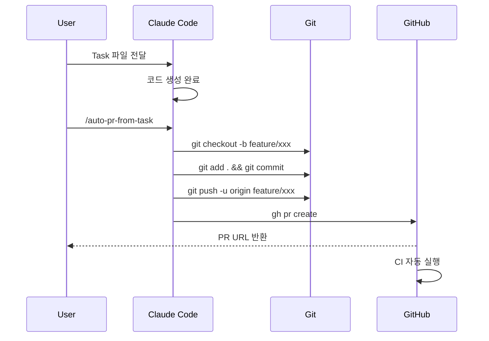
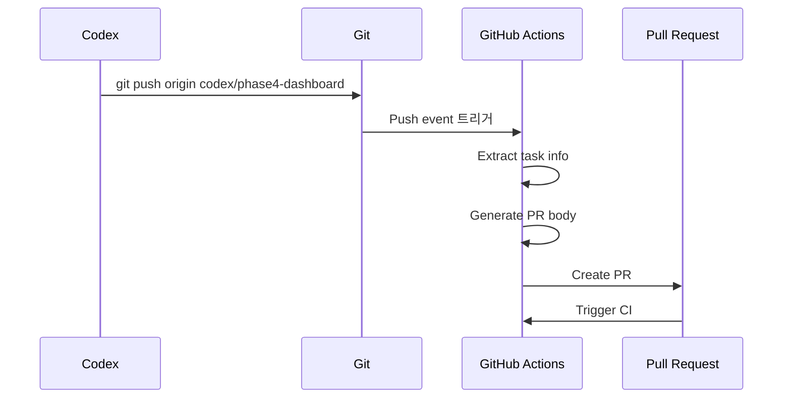

# Codex 자동화 워크플로우 가이드

## 개요
Codex가 코드 생성 완료 후 자동으로 PR까지 생성하는 워크플로우를 설명합니다.

## 🎯 목표
```
Task 생성 → Codex 코드 생성 → Commit → Branch Push → PR 생성 → CI 실행
```

---

## 워크플로우 비교

| 방법 | 장점 | 단점 | 추천 시나리오 |
|------|------|------|--------------|
| **1. Claude Code Skill** | 통합된 경험, 유연성 높음 | gh CLI 설치 필요 | 수동 제어 선호 시 |
| **2. GitHub Actions** | 완전 자동화, 권한 관리 쉬움 | 브랜치 규칙 필요 | 팀 협업, 규칙 엄격 시 |
| **3. Pre-push Hook** | 즉각 반응, 로컬 제어 | 로컬 환경 의존 | 개인 개발, 빠른 반복 |

---

## 방법 1: Claude Code Skill 사용 (추천 ⭐)

### 개요
Claude Code에서 skill을 호출하여 PR까지 자동 생성합니다.

### 워크플로우



### 사전 준비

1. **gh CLI 설치**
   ```bash
   # macOS
   brew install gh

   # Linux
   curl -fsSL https://cli.github.com/packages/githubcli-archive-keyring.gpg | sudo dd of=/usr/share/keyrings/githubcli-archive-keyring.gpg
   echo "deb [signed-by=/usr/share/keyrings/githubcli-archive-keyring.gpg] https://cli.github.com/packages stable main" | sudo tee /etc/apt/sources.list.d/github-cli.list
   sudo apt update
   sudo apt install gh

   # Windows
   winget install --id GitHub.cli
   ```

2. **gh CLI 인증**
   ```bash
   gh auth login
   # → GitHub.com 선택
   # → HTTPS 선택
   # → 브라우저에서 인증
   ```

3. **권한 확인**
   ```bash
   gh auth status
   # → ✓ Logged in to github.com as {username}
   ```

### 사용 방법

#### Step 1: Task 파일 생성
```bash
# Claude Code에서
/codex-task-generation

# 요구사항 입력: "Phase 4 의사 대시보드 구현"
# → docs/tasks/codex-20260107-phase4-dashboard.md 생성
```

#### Step 2: Codex 코드 생성
```
# Codex에게 task 파일 전달
"docs/tasks/codex-20260107-phase4-dashboard.md 파일을 보고 코드를 생성해줘"

# Codex가 코드 생성 완료
# - apps/doctor-dashboard/ 생성
# - server/api/auth.py 추가
# - shared/schemas/auth.py 추가
# ...
```

#### Step 3: Auto PR 실행
```
/auto-pr-from-task
```

#### Claude Code가 자동으로 수행:
```bash
# 1. Branch 생성
git checkout -b feature/phase4-dashboard

# 2. Commit
git add .
git commit -m "feat(dashboard): Phase 4 의사 대시보드 구현

- 의사 대시보드 앱 추가 (apps/doctor-dashboard/)
- 인증 시스템 (Admin/Doctor/Reviewer 역할 기반)
- 세션 조회/편집/확정 기능

🤖 Generated with Claude Code
Co-Authored-By: Claude Sonnet 4.5 <noreply@anthropic.com>"

# 3. Push
git push -u origin feature/phase4-dashboard

# 4. PR 생성
gh pr create \
  --title "feat(dashboard): Phase 4 의사 대시보드 구현" \
  --body "... (task에서 자동 생성)" \
  --base main \
  --head feature/phase4-dashboard
```

#### 결과
```
✅ Branch created: feature/phase4-dashboard
✅ Committed: 42 files changed
✅ Pushed to remote
✅ PR created: https://github.com/{owner}/befora-poc/pull/123
🔄 CI running...
```

### Skill 옵션

#### 기본 사용
```bash
/auto-pr-from-task
```

#### Task 파일 명시
```bash
/auto-pr-from-task docs/tasks/codex-20260107-phase4-dashboard.md
```

#### Draft PR 생성
```bash
/auto-pr-from-task --draft
```

#### Custom branch 이름
```bash
/auto-pr-from-task --branch feature/custom-name
```

---

## 방법 2: GitHub Actions 자동화

### 개요
특정 브랜치 규칙(`codex/**`)으로 push하면 자동으로 PR 생성됩니다.

### 워크플로우



### 사용 방법

#### Step 1: Codex 브랜치에 Push
```bash
# Codex가 코드 생성 완료 후
git checkout -b codex/phase4-dashboard
git add .
git commit -m "feat(dashboard): Phase 4 구현"
git push origin codex/phase4-dashboard
```

#### Step 2: GitHub Actions 자동 실행
```yaml
# .github/workflows/auto-pr-from-codex.yml이 자동 실행
# 1. Task 파일 검색 (docs/tasks/*phase4-dashboard.md)
# 2. PR 생성
# 3. Label 추가 (autogenerated, needs-review)
# 4. CI 트리거
```

#### 결과
- PR이 자동으로 생성됨
- CI가 자동으로 실행됨
- Slack/Discord 알림 (옵션)

### 장점
- 완전 자동화 (수동 개입 없음)
- 권한 관리 쉬움 (GITHUB_TOKEN 사용)
- 브랜치 규칙으로 통제

### 단점
- 브랜치명 규칙 강제 (`codex/**`)
- GitHub Actions 의존

---

## 방법 3: Pre-push Hook

### 개요
`git push` 시 자동으로 PR 생성합니다.

### 사용 방법

#### Step 1: Hook 활성화
```bash
# 이미 .husky/pre-push 파일이 생성되어 있음
chmod +x .husky/pre-push
```

#### Step 2: Codex 브랜치에서 Push
```bash
git checkout -b codex/phase4-dashboard
git add .
git commit -m "feat(dashboard): Phase 4 구현"
git push origin codex/phase4-dashboard

# 🤖 Pre-push hook이 자동으로 PR 생성
```

### 장점
- 즉각 반응 (push 즉시)
- 로컬 제어

### 단점
- 로컬 환경 의존 (gh CLI 필요)
- 팀원마다 설정 필요

---

## 추천 워크플로우 조합 🎯

### 개인 개발자
```
Task 생성 (/codex-task-generation)
  ↓
Codex 코드 생성
  ↓
/auto-pr-from-task (방법 1)
  ↓
PR 자동 생성 & CI 실행
```

### 팀 협업
```
Task 생성 (/codex-task-generation)
  ↓
Codex 코드 생성
  ↓
git push origin codex/{name}
  ↓
GitHub Actions 자동 PR 생성 (방법 2)
  ↓
CI 실행 & 알림
```

---

## PR Template 자동 생성

### Task 파일에서 추출되는 정보

```markdown
# PR 제목
feat({scope}): {task title}

# PR Body
## Summary
{task의 Goal}

## Changes
**Frontend:**
- Added: apps/doctor-dashboard/
- Modified: ...

**Backend:**
- Added: server/api/auth.py
- Modified: ...

**Shared:**
- Added: shared/schemas/auth.py

## Acceptance Criteria
{task의 Acceptance Criteria를 체크리스트로 변환}
- [ ] 로그인 후 세션 목록 조회 가능
- [ ] 세션 상세에서 슬롯 데이터 확인 가능
- [ ] Doctor가 슬롯 수정 및 메모 추가 가능
- [ ] ...

## Test Plan
```bash
{task의 Commands - 테스트 섹션}
```

## Security Review
{task의 Security Checklist}
- [ ] RBAC 적용
- [ ] At-rest encryption
- [ ] PII 로깅 금지
- [ ] ...

## Related Task
Implemented from: `docs/tasks/codex-20260107-phase4-dashboard.md`

🤖 Generated with [Claude Code](https://claude.com/claude-code)

Co-Authored-By: Claude Sonnet 4.5 <noreply@anthropic.com>
```

---

## CI 자동 실행

PR 생성 시 다음 CI가 자동으로 실행됩니다:

### Frontend CI
```yaml
# .github/workflows/frontend.yml
- Lint (ESLint)
- Format check (Prettier)
- Type check (TypeScript)
- Build (Vite)
- Unit tests (Vitest)
```

### Backend CI
```yaml
# .github/workflows/backend.yml
- Lint (ruff)
- Format check (black)
- Type check (mypy)
- Unit tests (pytest)
```

### E2E CI
```yaml
# .github/workflows/e2e.yml
- Playwright tests
- Screenshot artifacts
```

### Security CI
```yaml
# .github/workflows/security.yml
- Dependency check
- Secret scanning
- SAST (Semgrep)
```

---

## 트러블슈팅

### gh CLI 인증 오류
```bash
gh auth login
gh auth refresh
```

### Branch 이미 존재
```bash
git branch -D feature/phase4-dashboard
git checkout -b feature/phase4-dashboard
```

### PR 이미 존재
```bash
# 기존 PR 확인
gh pr list --head feature/phase4-dashboard

# 기존 PR 닫기
gh pr close {PR_NUMBER}

# 새 PR 생성
/auto-pr-from-task
```

### GitHub Actions 권한 오류
```yaml
# .github/workflows/auto-pr-from-codex.yml
permissions:
  contents: write        # Branch 생성
  pull-requests: write   # PR 생성
```

---

## 브랜치 전략

### Codex 브랜치 규칙
```
codex/{brief-description}

예시:
- codex/phase4-dashboard
- codex/webrtc-reconnect
- codex/dsl-emergency-flow
```

### Feature 브랜치 규칙
```
feature/{scope}-{description}

예시:
- feature/dashboard-auth
- feature/rtc-reconnect
- feature/dsl-emergency
```

### Main 브랜치 보호
```yaml
# GitHub Repository Settings
Branch protection rules for 'main':
- Require pull request before merging
- Require status checks to pass
- Require branches to be up to date
- Do not allow bypassing the above settings
```

---

## 자동화 체크리스트

### 실행 전
- [ ] gh CLI 설치 및 인증
- [ ] Task 파일 생성 완료
- [ ] Codex 코드 생성 완료
- [ ] 로컬 테스트 통과 (선택)

### 실행 후
- [ ] Branch 생성 확인
- [ ] Commit 메시지 확인
- [ ] Push 성공 확인
- [ ] PR 생성 확인
- [ ] CI 실행 확인
- [ ] PR URL 팀원 공유

---

## 다음 단계

1. **방법 선택**: 팀 상황에 맞는 방법 선택
2. **테스트**: 간단한 task로 워크플로우 테스트
3. **문서화**: 팀 wiki에 워크플로우 문서화
4. **자동화**: 반복 작업은 script로 자동화

---

**참고 문서**
- [.claude/skills/auto-pr-from-task.md](.claude/skills/auto-pr-from-task.md)
- [.github/workflows/auto-pr-from-codex.yml](.github/workflows/auto-pr-from-codex.yml)
- [GitHub CLI 문서](https://cli.github.com/manual/)
